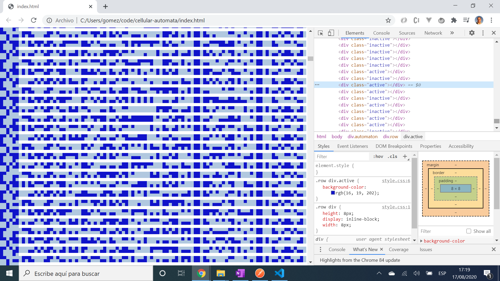

# :zap: Javascript Cellular Automatia

* Javascript used to produce an automata; a regular grid of cells, each one in a finite number of states. Code from [Youtube Cellular Automata - Pair Programming - FunFunFunction #49](https://www.youtube.com/watch?v=bc-fVdbjAwk)

*** Note: to open web links in a new window use: _ctrl+click on link_**

## :page_facing_up: Table of contents

* [:zap: Javascript Cellular Automatia](#zap-javascript-cellular-automatia)
  * [:page_facing_up: Table of contents](#page_facing_up-table-of-contents)
  * [:books: General info](#books-general-info)
  * [:camera: Screenshots](#camera-screenshots)
  * [:signal_strength: Technologies](#signal_strength-technologies)
  * [:floppy_disk: Setup](#floppy_disk-setup)
  * [:computer: Code Examples](#computer-code-examples)
  * [:cool: Features](#cool-features)
  * [:clipboard: Status & To-Do List](#clipboard-status--to-do-list)
  * [:clap: Inspiration](#clap-inspiration)
  * [:envelope: Contact](#envelope-contact)

## :books: General info

* **What is cellular automata?:** Plural of cellular automaton; "_a collection of "colored" cells on a grid of specified shape that evolves through a number of discrete time steps according to a set of rules based on the states of neighboring cells. The rules are then applied iteratively for as many time steps as desired_."

## :camera: Screenshots



## :signal_strength: Technologies

* [Google Chrome Javascript Engine v8](https://v8.dev/)

## :floppy_disk: Setup

* open `index.html` in browser

## :computer: Code Examples

* extract from `script.js` to alternate the class of a child node (just the colour of the cell is changed) using a random function

```javascript
function randomizeRow(rowDiv) {
  for (let i = 0; i < rowDiv.childNodes.length; i++) {
    let div = rowDiv.childNodes[i];
    div.classList.add(randomBinary() ? 'active' : 'inactive');
  }
}
```

## :cool: Features

* Cool patterns

## :clipboard: Status & To-Do List

* Status: Working
* To-Do: Comment code

## :clap: Inspiration

* [Youtube Cellular Automata - Pair Programming - FunFunFunction #49](https://www.youtube.com/watch?v=bc-fVdbjAwk)
* [Wikipedia: Cellular automaton](https://en.wikipedia.org/wiki/Cellular_automaton)

## :envelope: Contact

* Repo created by [ABateman](https://www.andrewbateman.org) - you are welcome to [send me a message](https://andrewbateman.org/contact)
